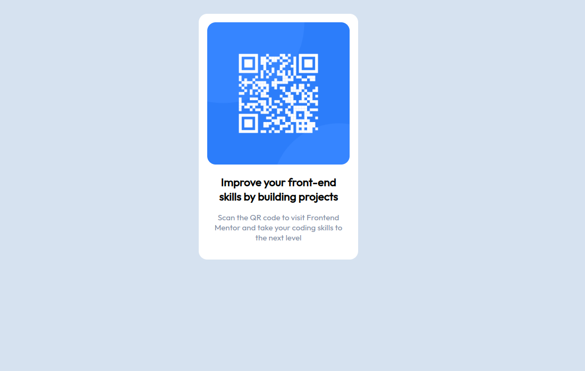
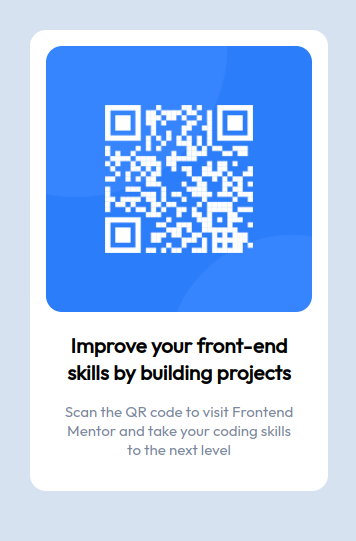

# Frontend Mentor - QR code component

## Welcome! 👋

Thanks for checking out this front-end coding challenge.

[Frontend Mentor](https://www.frontendmentor.io) challenges help you improve your coding skills by building realistic projects.

## Overview

### Built with

- HTML
- CSS

## Screenshots

Desktop:

Mobile:

## Links

Live: [qr-code](https://harireddy7.github.io/html-css-projects/qr-code)