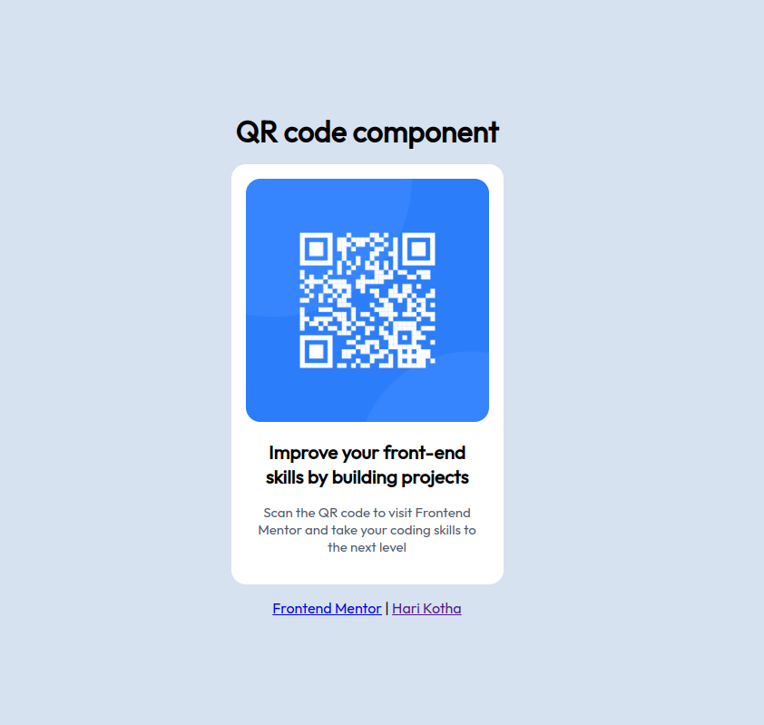

# Frontend Mentor - QR code component

This is a solution to the [QR code component challenge on Frontend Mentor](https://www.frontendmentor.io/challenges/qr-code-component-iux_sIO_H).

## Built with

- HTML
- CSS

## Screenshots

Desktop:

Mobile:

## Links

Live: [qr-code](https://harireddy7.github.io/html-css-projects/qr-code) 🚀

## Author

- Website - [Hari Kotha](https://harikotha.netlify.app)
- Frontend Mentor - [@harireddy7](https://www.frontendmentor.io/profile/harireddy7)
- Twitter - [@harikotha07](https://www.twitter.com/harikotha07)